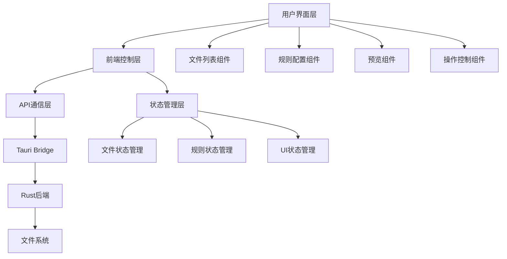

# 设计文档

## 概述

本设计文档基于现有的Tauri + JavaScript架构，为增强的文件重命名工具界面提供详细的技术设计方案。新界面将在现有功能基础上进行重构和增强，提供更直观的用户体验和更强大的功能。

### 来源与对齐声明

- 主来源：`docs/01.prototype-v3-interface.md`（UI/交互/功能的最终依据）
- 辅来源：`docs/04.CHANGELOG.md` 与 `docs/archive/ROADMAP-v3.0.md`（用于补充阶段目标、性能指标与技术约束）
- 冲突处理：若与辅来源不一致，一律以原型文档为准
- 追踪约定：本文件中的设计项与 `requirements.md` 的需求编号、`tasks.md` 的任务编号一一映射

## 架构

### 技术栈
- **前端**: HTML5 + JavaScript (ES6+) + CSS3
- **UI框架**: Pico CSS (已使用)
- **后端**: Rust + Tauri 2.0
- **构建工具**: Vite
- **包管理**: npm

### 系统架构图



## 组件和接口

### 前端组件架构

#### 1. 主容器组件 (MainContainer)
- **职责**: 整体布局管理，组件协调
- **状态**: 应用级状态管理
- **接口**: 
  ```javascript
  class MainContainer {
    constructor()
    init()
    render()
    handleResize()
  }
  ```

#### 2. 文件管理组件 (FileManager)
- **职责**: 文件导入、列表显示、状态管理、搜索和排序
- **状态**: 文件列表、选择状态、权限信息、排序状态、搜索过滤
- **接口**:
  ```javascript
  class FileManager {
    constructor(container)
    addFiles(filePaths)
    addFolder(folderPath)
    removeFiles(indices)
    removeSelectedFiles()
    clearAll()
    getSelectedFiles()
    updateFileStatus(index, status)
    renderFileList()
    // 新增搜索和排序功能
    searchFiles(query)
    sortFiles(column, direction)
    filterByExtension(extensions)
    selectFile(index, selected)
    selectAll(selected)
  }
  ```

#### 3. 规则配置组件 (RuleConfig)
- **职责**: 重命名规则的配置和验证
- **状态**: 当前规则类型、规则参数
- **支持规则**: 查找替换、添加序列、切片替换、大小写转换、扩展名修改
- **接口**:
  ```javascript
  class RuleConfig {
    constructor(container)
    setActiveRule(ruleType)
    getRuleData()
    validateRule()
    resetRule()
    onRuleChange(callback)
    // 新增方法
    getSupportedRules()
    validateSliceRule(data)
    validateExtensionRule(data)
  }
  ```

#### 4. 预览组件 (PreviewManager)
- **职责**: 实时预览、冲突检测、状态显示
- **状态**: 预览结果、冲突信息、验证状态
- **接口**:
  ```javascript
  class PreviewManager {
    constructor(fileManager, ruleConfig)
    updatePreview()
    checkConflicts()
    highlightChanges()
    showValidationErrors()
  }
  ```

#### 5. 操作控制组件 (ActionController)
- **职责**: 批量操作、进度管理、撤销功能
- **状态**: 操作状态、进度信息、历史记录
- **接口**:
  ```javascript
  class ActionController {
    constructor(fileManager, ruleConfig)
    executeRename()
    showProgress(current, total)
    undo()
    canUndo()
    canExecute()
  }
  ```

### 后端接口设计

#### 现有接口优化
基于现有的Rust后端，优化以下接口：

```rust
// 文件操作接口
#[tauri::command]
async fn list_files_enhanced(paths: Vec<String>, options: FileListOptions) -> Result<Vec<FileInfo>, String>

#[tauri::command] 
async fn get_file_metadata(paths: Vec<String>) -> Result<Vec<FileMetadata>, String>

// 重命名操作接口
#[tauri::command]
async fn preview_rename(files: Vec<String>, rule: RenameRule) -> Result<Vec<PreviewResult>, String>

#[tauri::command]
async fn execute_rename_batch(operations: Vec<RenameOperation>) -> Result<BatchRenameResult, String>

// 撤销操作接口
#[tauri::command]
async fn undo_rename(operation_id: String) -> Result<UndoResult, String>
```

#### 新增数据结构

```rust
#[derive(Serialize, Deserialize)]
struct FileInfo {
    name: String,
    path: String,
    size: u64,
    modified: SystemTime,
    extension: Option<String>,
    permissions: FilePermissions,
    selected: bool,
    status: FileStatus, // Ready, Processing, Success, Failed
}

#[derive(Serialize, Deserialize)]
struct FileMetadata {
    path: String,
    is_directory: bool,
    size: u64,
    modified: SystemTime,
    permissions: FilePermissions,
}

// RenameRule 定义见下文“规则系统（v3.0 覆盖）”节，避免重复定义

#[derive(Serialize, Deserialize, Debug)]
pub enum FileStatus {
    Ready,
    Processing,
    Success,
    Failed,
}

#[derive(Serialize, Deserialize)]
struct PreviewResult {
    original_name: String,
    new_name: String,
    has_conflict: bool,
    has_invalid_chars: bool,
    error_message: Option<String>,
}

#[derive(Serialize, Deserialize)]
struct BatchRenameResult {
    success_count: usize,
    failed_count: usize,
    operations: Vec<RenameOperationResult>,
    operation_id: String,
}
```

## 数据模型

### 前端状态管理

#### 1. 应用状态 (AppState)
```javascript
const AppState = {
  // 文件相关状态
  files: [],
  selectedFiles: [],
  fileCount: 0,
  successCount: 0,
  failedCount: 0,
  
  // 搜索和排序状态
  searchQuery: '',
  sortColumn: 'name',
  sortDirection: 'asc', // 'asc' | 'desc'
  filteredFiles: [],
  
  // 规则相关状态
  activeRule: 'replace',
  ruleData: {},
  
  // UI状态
  isLoading: false,
  showProgress: false,
  progressValue: 0,
  selectedFileDetails: null,
  
  // 操作状态
  canUndo: false,
  lastOperationId: null,
  
  // 预览状态
  previewResults: [],
  hasConflicts: false,
  hasErrors: false
}
```

#### 2. 文件模型 (FileModel)
```javascript
class FileModel {
  constructor(path) {
    this.path = path
    this.name = this.extractFileName(path)
    this.extension = this.extractExtension(path)
    this.size = 0
    this.modified = null
    this.permissions = { readable: true, writable: true }
    this.selected = false
    this.previewName = this.name
    this.hasConflict = false
    this.hasInvalidChars = false
    this.status = 'ready' // ready, processing, success, error
  }
}
```

#### 3. 规则模型 (RuleModel)
```javascript
const RuleTypes = {
  REPLACE: 'replace',
  SEQUENCE: 'sequence', 
  SLICE: 'slice',
  CASE: 'case',
  EXTENSION: 'extension'
}

class RuleModel {
  constructor(type) {
    this.type = type
    this.data = this.getDefaultData(type)
    this.isValid = false
  }
  
  getDefaultData(type) {
    switch(type) {
      case RuleTypes.REPLACE:
        return { find: '', replace: '' }
      case RuleTypes.SEQUENCE:
        return { start: 1, digits: 2, position: 'prefix' }
      case RuleTypes.SLICE:
        return { startIndex: 0, endIndex: -1, replaceWith: '' }
      case RuleTypes.CASE:
        return { caseType: '' }
      case RuleTypes.EXTENSION:
        return { newExtension: '', keepOriginal: false }
      default:
        return {}
    }
  }
}
```

## 错误处理

### 前端错误处理策略

#### 1. 用户输入验证
```javascript
class ValidationManager {
  static validateReplaceRule(data) {
    if (!data.find) {
      return { valid: false, message: '请输入要查找的内容' }
    }
    return { valid: true }
  }
  
  static validateSequenceRule(data) {
    if (!data.start || data.start < 0) {
      return { valid: false, message: '起始数字必须大于等于0' }
    }
    if (!data.digits || data.digits < 1) {
      return { valid: false, message: '数字位数必须大于0' }
    }
    return { valid: true }
  }
  
  static validateCaseRule(data) {
    if (!data.caseType) {
      return { valid: false, message: '请选择大小写转换类型' }
    }
    return { valid: true }
  }
  
  static validateSliceRule(data) {
    if (data.startIndex < 0) {
      return { valid: false, message: '起始位置不能小于0' }
    }
    if (data.endIndex !== -1 && data.endIndex <= data.startIndex) {
      return { valid: false, message: '结束位置必须大于起始位置' }
    }
    return { valid: true }
  }
  
  static validateExtensionRule(data) {
    if (!data.newExtension && !data.keepOriginal) {
      return { valid: false, message: '请输入新的扩展名或选择保留原扩展名' }
    }
    if (data.newExtension && !/^[a-zA-Z0-9]+$/.test(data.newExtension)) {
      return { valid: false, message: '扩展名只能包含字母和数字' }
    }
    return { valid: true }
  }
}
```

#### 2. 文件操作错误处理
```javascript
class ErrorHandler {
  static handleFileError(error, context) {
    const errorMap = {
      'EACCES': '权限不足，无法访问文件',
      'ENOENT': '文件不存在',
      'EBUSY': '文件正在被使用',
      'EMFILE': '打开文件数量过多'
    }
    
    const message = errorMap[error.code] || error.message
    this.showError(message, context)
  }
  
  static showError(message, context = '') {
    // 使用现有的showErrorMsg函数
    showErrorMsg(`${context}: ${message}`)
  }
}
```

### 后端错误处理

#### 1. 文件系统错误
```rust
#[derive(Debug, Serialize)]
enum FileSystemError {
    PermissionDenied(String),
    FileNotFound(String),
    FileInUse(String),
    InvalidPath(String),
    DiskFull,
    Unknown(String),
}

impl From<std::io::Error> for FileSystemError {
    fn from(error: std::io::Error) -> Self {
        match error.kind() {
            std::io::ErrorKind::PermissionDenied => FileSystemError::PermissionDenied(error.to_string()),
            std::io::ErrorKind::NotFound => FileSystemError::FileNotFound(error.to_string()),
            _ => FileSystemError::Unknown(error.to_string()),
        }
    }
}
```

#### 2. 重命名操作错误处理
```rust
#[tauri::command]
async fn execute_rename_with_recovery(
    operations: Vec<RenameOperation>
) -> Result<BatchRenameResult, String> {
    let mut completed_operations = Vec::new();
    let mut failed_operations = Vec::new();
    
    for operation in operations {
        match perform_rename(&operation).await {
            Ok(result) => {
                completed_operations.push(result);
            }
            Err(e) => {
                // 记录失败操作，继续处理其他文件
                failed_operations.push(FailedOperation {
                    operation,
                    error: e.to_string(),
                });
                
                // 如果是严重错误，考虑回滚已完成的操作
                if is_critical_error(&e) {
                    rollback_operations(&completed_operations).await;
                    return Err(format!("Critical error occurred: {}", e));
                }
            }
        }
    }
    
    Ok(BatchRenameResult {
        success_count: completed_operations.len(),
        failed_count: failed_operations.len(),
        operations: completed_operations,
        failed_operations,
        operation_id: generate_operation_id(),
    })
}
```

## 测试策略

### 前端测试

#### 1. 单元测试
- 组件功能测试
- 状态管理测试
- 工具函数测试

#### 2. 集成测试
- 组件间交互测试
- API调用测试
- 用户操作流程测试

#### 3. 用户界面测试
- 响应式布局测试
- 交互反馈测试
- 错误状态显示测试

### 后端测试

#### 1. 单元测试
```rust
#[cfg(test)]
mod tests {
    use super::*;
    
    #[tokio::test]
    async fn test_list_files_basic() {
        let paths = vec!["test_folder".to_string()];
        let result = list_files(paths).await;
        assert!(result.is_ok());
    }
    
    #[tokio::test]
    async fn test_rename_with_conflicts() {
        // 测试重名冲突处理
    }
    
    #[tokio::test]
    async fn test_permission_handling() {
        // 测试权限检查
    }
}
```

#### 2. 集成测试
- 文件系统操作测试
- 批量重命名测试
- 错误恢复测试

## 性能优化

### 前端性能优化

#### 1. 虚拟滚动
对于大量文件的列表显示，实现虚拟滚动：
```javascript
class VirtualScrollManager {
  constructor(container, itemHeight) {
    this.container = container
    this.itemHeight = itemHeight
    this.visibleItems = Math.ceil(container.clientHeight / itemHeight) + 2
  }
  
  render(items, startIndex) {
    // 只渲染可见区域的项目
    const visibleItems = items.slice(startIndex, startIndex + this.visibleItems)
    this.renderItems(visibleItems, startIndex)
  }
}
```

#### 2. 防抖处理
对于实时预览功能，使用防抖避免频繁更新：
```javascript
class DebounceManager {
  static debounce(func, wait) {
    let timeout
    return function executedFunction(...args) {
      const later = () => {
        clearTimeout(timeout)
        func(...args)
      }
      clearTimeout(timeout)
      timeout = setTimeout(later, wait)
    }
  }
}

// 使用防抖的预览更新
const debouncedUpdatePreview = DebounceManager.debounce(updatePreview, 300)
```

#### 3. 批量DOM操作
```javascript
class DOMBatchManager {
  static batchUpdate(container, updates) {
    const fragment = document.createDocumentFragment()
    updates.forEach(update => {
      const element = update.createElement()
      fragment.appendChild(element)
    })
    container.appendChild(fragment)
  }
}
```

### 后端性能优化

#### 1. 并发处理
```rust
use tokio::task::JoinSet;

async fn process_files_concurrent(files: Vec<String>) -> Result<Vec<FileInfo>, String> {
    let mut set = JoinSet::new();
    
    for file in files {
        set.spawn(async move {
            process_single_file(file).await
        });
    }
    
    let mut results = Vec::new();
    while let Some(res) = set.join_next().await {
        match res {
            Ok(file_info) => results.push(file_info?),
            Err(e) => return Err(format!("Task failed: {}", e)),
        }
    }
    
    Ok(results)
}
```

#### 2. 内存优化
```rust
// 使用流式处理大文件夹
async fn stream_directory_files(path: &Path) -> impl Stream<Item = Result<FileInfo, std::io::Error>> {
    let read_dir = tokio::fs::read_dir(path).await?;
    read_dir.map(|entry| {
        let entry = entry?;
        Ok(FileInfo::from_path(entry.path()))
    })
}
```

## 安全考虑

### 1. 路径验证
```rust
fn validate_file_path(path: &str) -> Result<PathBuf, String> {
    let path = PathBuf::from(path);
    
    // 检查路径遍历攻击
    if path.components().any(|comp| comp == Component::ParentDir) {
        return Err("Invalid path: contains parent directory references".to_string());
    }
    
    // 检查绝对路径
    if !path.is_absolute() {
        return Err("Path must be absolute".to_string());
    }
    
    Ok(path)
}
```

### 2. 权限检查
```rust
async fn check_operation_permissions(operations: &[RenameOperation]) -> Result<(), String> {
    for operation in operations {
        let path = Path::new(&operation.old_path);
        
        // 检查读权限
        if !path.exists() {
            return Err(format!("File does not exist: {}", operation.old_path));
        }
        
        // 检查写权限
        let metadata = path.metadata()
            .map_err(|e| format!("Cannot read metadata: {}", e))?;
            
        if metadata.permissions().readonly() {
            return Err(format!("File is read-only: {}", operation.old_path));
        }
    }
    
    Ok(())
}
```

### 3. 输入清理
```javascript
class InputSanitizer {
  static sanitizeFileName(name) {
    // 移除或替换非法字符
    return name.replace(/[<>:"/\\|?*]/g, '_')
               .replace(/\s+/g, ' ')
               .trim()
  }
  
  static validateFileNameLength(name) {
   const MAX_LENGTH = 255
   return name.length <= MAX_LENGTH
 }
}
```

## v3.0 设计对齐与取舍

### 1. 布局与交互对齐（基于 `docs/prototype-v3-interface.md`）
- 顶部工具栏：应用标题与图标、开始重命名、清空列表、主题切换、全局设置。
- 左侧文件列表：列包含 文件名/新文件名/扩展名/大小/修改时间；列可排序；支持点击移除所选文件。
- 右侧配置面板：规则Tab（查找替换、添加序列、切片替换、大小写、扩展名）；规则参数区；设置区。
- 底部状态栏：文件统计（总数/选中/成功/失败）、进度显示（执行/撤销过程百分比）。

实现细节：
- 列表虚拟滚动（>1k文件时启用），批量局部刷新（diff高亮），防抖（100–300ms）控制预览更新。
- 预览冲突与非法字符高亮；冲突时禁用“开始重命名”并在工具栏给出原因。

### 2. 主题与控件一致性（Pico.css 实践）
- 主题切换即时生效并持久化（localStorage）。
- 控件可见反馈：对 radio/checkbox/switch 显式设置 `appearance` 与尺寸、边框、选中样式，避免仅靠 `accent-color` 导致反馈不明显（见 `MEMORY: pico css radio` 经验）。
- 窄屏适配：工具栏按钮自适应收起为溢出菜单；Tab可横向滚动或折叠。

### 3. 规则系统（v3.0 覆盖）
后端规则类型（Rust）：
```rust
#[serde(tag = "type")]
pub enum RenameRule {
  Replace { find: String, replace: String, regex: bool, case_sensitive: bool },
  Sequence { start: i64, step: i64, width: usize, order: String },
  Slice { start: isize, end: Option<isize>, replacement: String },
  Case { mode: String /* upper|lower|title|snake|kebab */ },
  Extension { new_extension: Option<String>, keep_original: bool },
}
```
- v3.0 需要支持上述五类规则；高级规则（时间戳、字符清理、字段重组、拼音/音译等）进入 v3.x。
- 前端 `RuleConfig` 组件分规则子组件负责输入与校验；`PreviewManager` 聚合预览并做冲突检测。

### 4. 后端能力现状与迭代路径
- 现状（参考存量实现与记忆）：`execute_rename` 仅支持 Replace。缺少多步撤销/重做的后端历史栈能力。
- v3.0 目标：
  - 扩展 `RenameRule` 枚举；在 `execute_rename_batch` 内按 `type` 分发逻辑，加入两阶段改名避免同名覆盖（临时名/事务化）。
  - 提供 `preview_rename(files, rule)` 纯函数式预览（不触盘），与前端预览一致。
  - 提供单次批量撤销能力：返回 `operation_id`，支持 `undo_rename(operation_id)` 反向应用；如实现周期受限，则以前端快照为兜底，并在UI提示限制。
- v3.x 目标：引入后端历史堆栈（多步 undo/redo），对齐接口：`undo_last() / redo_last()` 与命令索引访问。

### 5. 接口契约（v3.0）
```rust
#[tauri::command]
async fn preview_rename(files: Vec<String>, rule: RenameRule) -> Result<Vec<PreviewResult>, String>;

#[tauri::command]
async fn execute_rename_batch(ops: Vec<RenameOperation>) -> Result<BatchRenameResult, String>; // 两阶段改名 + 结果统计 + operation_id

#[tauri::command]
async fn undo_rename(operation_id: String) -> Result<UndoResult, String>; // v3.0 单批次撤销
```
错误约定：
- 参数错误 4xx（如非法切片索引、扩展名不合法）；系统错误 5xx（IO/权限/并发失败）。
- 冲突策略：默认失败并上报；可在“全局设置”启用自动追加序号策略（v3.x）。

### 6. 性能与稳健性
- Rust：`JoinSet` 并发处理、分块IO、路径与权限校验（拒绝只读/不存在/父目录逃逸）。
- 前端：虚拟列表、批量DOM更新、预览防抖、工作线程（可选）分担重计算。
- 目标：预览<100ms（1万文件场景下分批渲染）、空闲<50MB、常规<200MB。

### 7. 可测试性
- 规则算法可单测（前后端同样的测试用例集）。
- 接口集成测试：预览与执行一致性、冲突检测、事务回滚。
- 端到端：导入→配置→预览→执行→撤销→统计 展示路径。