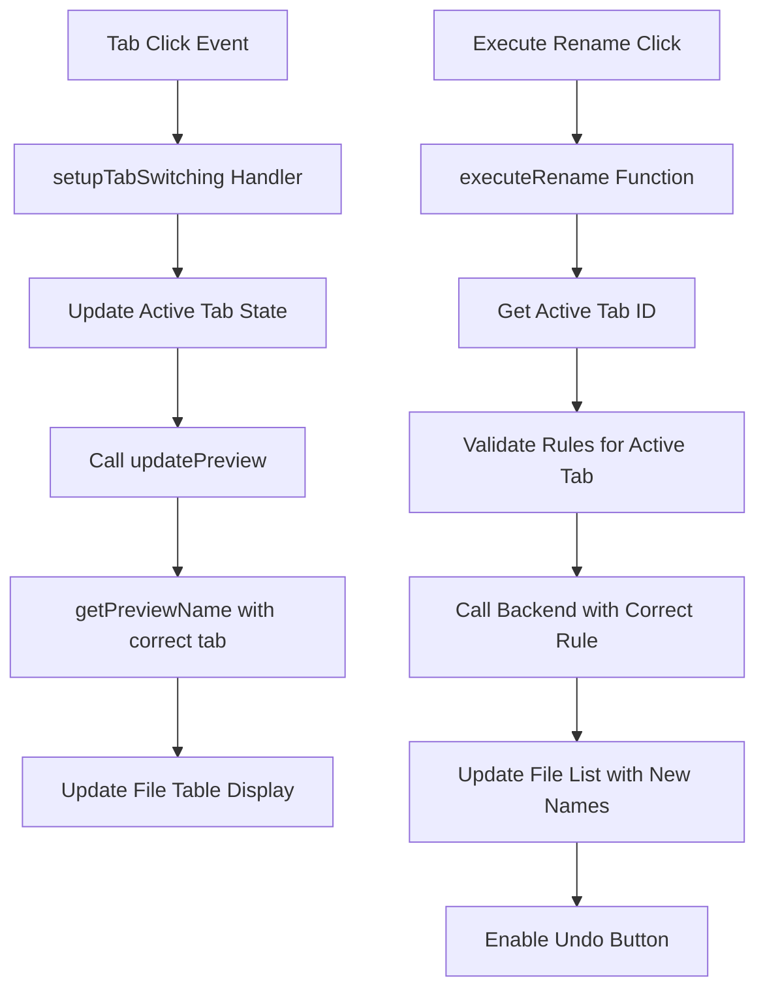

# 设计文档

## 概述

本设计解决文件批量重命名应用中标签页切换逻辑、预览系统和用户界面的关键错误。核心问题是 `setupTabSwitching()` 和 `executeRename()` 函数错误地处理标签页识别，导致所有非替换操作失败。设计重点是修复标签页切换机制，确保正确的预览更新，在操作后维护文件列表状态，以及优化UI。

## 架构

### 当前架构问题

1. **标签页切换逻辑**: 当前的 `setupTabSwitching()` 函数在标签页切换时没有正确触发预览更新
2. **预览系统**: `updatePreview()` 和 `getPreviewName()` 函数有不一致的标签页识别逻辑
3. **执行函数**: `executeRename()` 有缺陷的活动标签页检测，导致错误的规则验证
4. **状态管理**: 成功操作后文件列表被错误地清空

### 建议的架构改进



## 组件和接口

### 1. 标签页管理组件

**当前问题:**
- 标签页切换不触发预览更新
- 不一致的标签页ID获取方法

**设计解决方案:**
```javascript
function setupTabSwitching() {
    tabLinks.forEach((btn) => {
        btn.addEventListener("click", (e) => {
            e.preventDefault();
            // Remove all active classes
            tabLinks.forEach((b) => b.classList.remove("active"));
            tabContents.forEach((c) => c.classList.remove("active"));
            
            // Add active class to clicked tab
            btn.classList.add("active");
            const tabId = btn.getAttribute("data-tab");
            const tabContent = document.getElementById(tabId);
            if (tabContent) {
                tabContent.classList.add("active");
            }
            
            // CRITICAL: Always update preview after tab switch
            updatePreview();
            
            // Refresh button states
            document.dispatchEvent(new Event("refresh-apply"));
        });
    });
}
```

### 2. 预览系统组件

**当前问题:**
- `getPreviewName()` 函数有错误的标签页识别
- 预览在标签页间不一致地更新

**设计解决方案:**
```javascript
function getPreviewName(fileName, withHighlight = false, fileIndex = 0) {
    // Use consistent method to get active tab
    const activeTab = document.querySelector(".tab-content.active");
    if (!activeTab) return fileName;
    
    const tabId = activeTab.id;
    
    switch (tabId) {
        case "tab-replace":
            return getPreviewForReplace(fileName, withHighlight);
        case "tab-sequence":
            return getPreviewForSequence(fileName, withHighlight, fileIndex);
        case "tab-case":
            return getPreviewForCase(fileName, withHighlight);
        default:
            return fileName;
    }
}
```

### 3. 执行重命名组件

**当前问题:**
- 错误的活动标签页检测
- 错误的规则验证逻辑
- 成功操作后文件列表被清空

**设计解决方案:**
```javascript
async function executeRename(filePaths, activeTabId, ruleData) {
    // Fix: Use consistent tab ID format
    const normalizedTabId = activeTabId.replace("tab-", "");
    
    // Fix: Correct validation for each tab type
    if (normalizedTabId === "replace" && !ruleData.find) {
        showErrorMsg("请输入要查找的内容");
        return;
    }
    if (normalizedTabId === "sequence" && (!ruleData.start || !ruleData.digits)) {
        showErrorMsg("请填写序列号起始和位数");
        return;
    }
    if (normalizedTabId === "case" && !ruleData.caseType) {
        showErrorMsg("请选择大小写转换类型");
        return;
    }
    
    // Execute rename operation
    const result = await invoke("execute_rename", {
        filePaths: filePaths,
        rule: backendRule,
    });
    
    if (result.success && result.renamed_count > 0) {
        // Fix: Don't clear file list, update with new names
        updateFileListWithNewNames(result);
        showErrorMsg(`成功重命名 ${result.renamed_count} 个文件`, true);
        
        // Enable undo button
        if (undoRenameButton) undoRenameButton.disabled = false;
    }
}
```

### 4. 文件列表管理组件

**设计解决方案:**
```javascript
function updateFileListWithNewNames(renameResult) {
    // Instead of clearing loadedFiles, update with new names
    loadedFiles.forEach((fileInfo, index) => {
        if (fileInfo.newPath && fileInfo.newPath !== fileInfo.name) {
            // Update the file info with the new name
            fileInfo.name = fileInfo.newPath;
            // Reset newPath to show no further changes needed
            fileInfo.newPath = fileInfo.name;
        }
    });
    
    // Update the table display
    updateFileTable();
    updateFileCount();
}
```

## 数据模型

### 标签页状态模型
```javascript
const TabState = {
    activeTabId: string,           // "tab-replace", "tab-sequence", "tab-case"
    isPreviewValid: boolean,       // Whether current preview is valid
    hasValidRules: boolean         // Whether current tab has valid input rules
}
```

### 文件信息模型（增强版）
```javascript
const FileInfo = {
    name: string,                  // Current file name
    path: string,                  // Full file path
    newPath: string,              // Preview name or new name after rename
    hasConflict: boolean,         // Whether there's a naming conflict
    invalidChar: boolean,         // Whether contains invalid characters
    readable: boolean,            // File read permission
    writable: boolean             // File write permission
}
```

## 错误处理

### 标签页特定错误消息
```javascript
function getTabSpecificErrorMessage(tabId, ruleData) {
    switch (tabId) {
        case "tab-replace":
            if (!ruleData.find) return "请输入要查找的内容";
            break;
        case "tab-sequence":
            if (!ruleData.start || !ruleData.digits) return "请填写序列号起始和位数";
            break;
        case "tab-case":
            if (!ruleData.caseType) return "请选择大小写转换类型";
            break;
    }
    return null;
}
```

### 预览错误处理
- 优雅地处理找不到标签页内容的情况
- 在预览生成失败时提供回退行为
- 在UI中显示适当的错误状态

## 测试策略

### 单元测试重点领域

1. **标签页切换逻辑**
   - 测试标签页切换触发预览更新
   - 验证正确的标签页ID获取
   - 确保正确的CSS类管理

2. **预览生成**
   - 测试每种标签页类型的预览生成
   - 验证序列模式中的文件索引处理
   - 测试空输入的边缘情况

3. **执行重命名逻辑**
   - 测试活动标签页检测准确性
   - 验证每个标签页的规则验证
   - 测试重命名后文件列表保留

4. **按钮状态管理**
   - 测试撤销按钮启用/禁用逻辑
   - 验证各种操作后的按钮状态
   - 测试按钮布局和文本换行

### 集成测试

1. **端到端标签页工作流**
   - 每种标签页类型的完整重命名操作
   - 活动操作期间的标签页切换
   - 每个标签页操作后的撤销功能

2. **文件列表管理**
   - 成功重命名后的文件列表状态
   - 失败操作后的文件列表状态
   - 撤销操作对文件列表的影响

### 手动测试场景

1. **标签页切换行为**
   - 快速在所有三个标签页之间切换
   - 验证预览立即更新
   - 检查切换期间是否有错误消息

2. **规则验证**
   - 用空/无效输入测试每个标签页
   - 验证适当的错误消息
   - 测试执行按钮启用/禁用状态

3. **UI响应性**
   - 在不同窗口大小下测试按钮布局
   - 验证按钮中没有文本换行
   - 检查禁用状态的视觉反馈